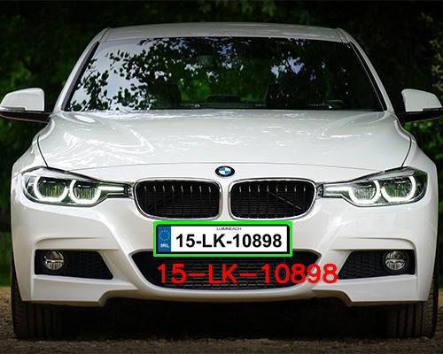

# Car license plate recognition

## 📌 Overview

This project implements automatic license plate detection on images and videos using the YOLOv11 deep learning model. The solution leverages the power of real-time object detection for vehicle surveillance, parking systems, and traffic analytics.

## 🖼️ Example

